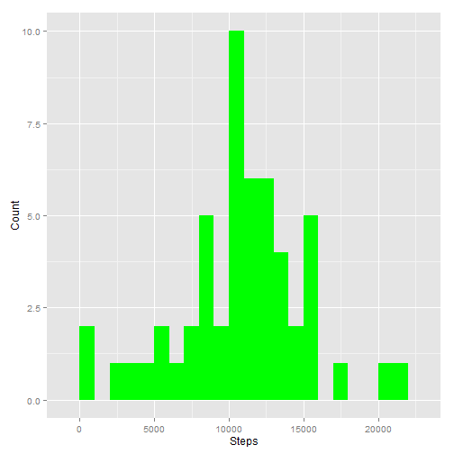
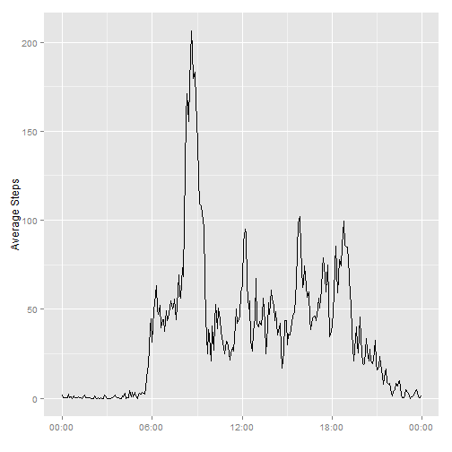
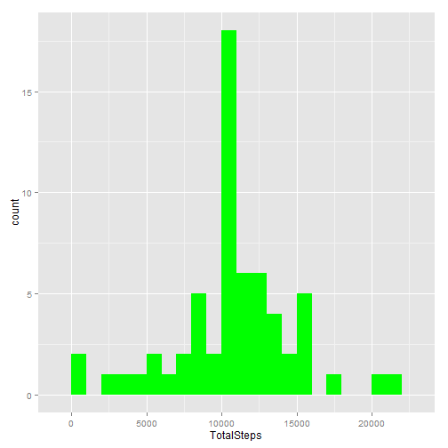
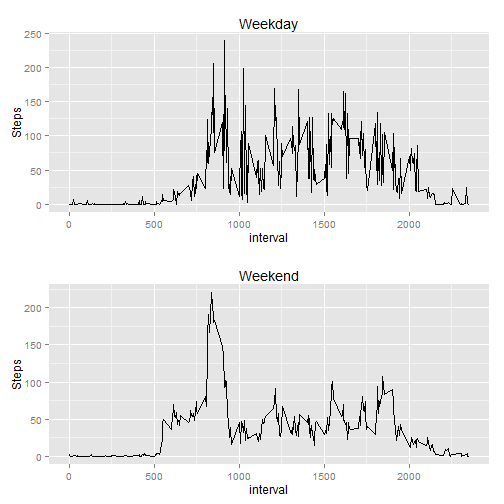

**The code for loading and preprocessing the analyzed data**

```r
setwd("C:/Aylin/Reproducible Research") 
data<-read.csv("activity.csv",header=T,colClasses=c("integer","Date","integer")) 
completerows<-complete.cases(data)
completedata<-data[completerows,]
```

**What is mean total number of steps taken per day?**
Here's the code to calculate the total number of steps taken each day:

```r
library(dplyr) 
library(ggplot2)
mydata<-tbl_df(completedata)
dailysteps<-mydata %>%
        group_by(date) %>%
        summarize(total_steps=sum(steps))
```

And here's the code for creating the corresponding histogram.

```r
m<-ggplot(dailysteps,aes(x=total_steps))
m+geom_histogram(binwidth=1000,fill="green")+xlab("Steps")+ylab("Count")
```

 

The mean and median of the total number of steps taken per day.

```r
output1<-dailysteps %>%
        summarize(Mean=mean(total_steps),Median=median(total_steps))
output1
```

```
## Source: local data frame [1 x 2]
## 
##       Mean Median
## 1 10766.19  10765
```

***What is the average daily activity pattern?***
Below is the code to create a time series plot of the 5-minute interval (x-axis) and the average number of steps taken, averaged across all days (y-axis).

```r
library(scales)
tsdata<-tbl_df(completedata)
tsdatatoplot<-tsdata %>%
        group_by(interval) %>%
        summarize(avg_steps=mean(steps))
newdata<-data.frame(tsdatatoplot)
newdata[,1]<-formatC(newdata[,1],width=4,flag="0",format="d",big.mark = ":",big.interval = 2)
newdata[,1]<-as.POSIXct(strptime(newdata[,1],"%H:%M"))
ggplot(newdata,aes(x=interval,y=avg_steps))+geom_line()+xlab("")+ylab("Average Steps")+ 
        scale_x_datetime(labels=date_format("%H:%M"))
```

 

The 5-minute interval that, on average, contains the maximum number of steps is given by the following code:

```r
subset(tsdatatoplot,avg_steps==max(tsdatatoplot[,2]))
```

```
## Source: local data frame [1 x 2]
## 
##   interval avg_steps
## 1      835  206.1698
```

***Imputing missing values***

The number o NA rows is given by:

```r
freq<-table(completerows)
freq[1]
```

```
## FALSE 
##  2304
```

We'll replace the missing values (NAs) with the average steps taken within each 5-minut interval in order to create a new dataset with complete rows.

```r
mv<-mydata %>%
        group_by(interval) %>%
        summarize(newval=mean(steps))##The average number os steps for each 5-minute interval
incompleterows<-data[!completerows,] ##Incomplete rows which need to be filled in with the calculated mean
newdata<-merge(x=incompleterows,y=mv,by="interval",all.x=T) 
newdata[,2]<-newdata[,4]
newdata<-newdata[,1:3]
dataset<-rbind(newdata,completedata)
mydata2<-tbl_df(dataset)
dailysteps2<-mydata2 %>%
        group_by(date) %>%
        summarize(TotalSteps=sum(steps))
histo<-ggplot(dailysteps2,aes(x=TotalSteps))
histo+geom_histogram(binwidth=1000,fill="green")
```

 

```r
output2<-dailysteps2 %>%
        summarize(avg=mean(TotalSteps),med=median(TotalSteps))
output2##Mean and Median based on the new data set 
```

```
## Source: local data frame [1 x 2]
## 
##        avg      med
## 1 10766.19 10766.19
```

Differences between the two means and medians:

```r
output1-output2
```

```
##   Mean    Median
## 1    0 -1.188679
```
Thus, we can conclude that filling in missing values with the means has a low impact on the estimates of the total number of steps

***Are there differences in activity patterns between weekdays and weekends?***

```r
dataset[,3]<-as.POSIXct(strptime(dataset[,3],"%Y-%m-%d"))
dataset$WDay<-weekdays(dataset[,3])
dataset$pf<-factor(dataset$WDay != c("Saturday", "Sunday"))
levels(dataset$pf)[levels(dataset$pf)=="TRUE"] <- "WeekDay"
levels(dataset$pf)[levels(dataset$pf)=="FALSE"] <- "WeekEnd"
wdaydata<-as.data.frame(subset(dataset,pf=="WeekDay"))
wenddata<-as.data.frame(subset(dataset,pf=="WeekEnd"))
getData<-function(x){
        y<-tbl_df(x) %>%
                group_by(interval) %>%
                summarize(Steps =mean(steps))
        y
}
wendTotals<-getData(wenddata)
wdayTotals<-getData(wdaydata)
p1<-ggplot(wendTotals,aes(x=interval,y=Steps))+geom_line()+ggtitle("Weekday")
p2<-ggplot(wdayTotals,aes(x=interval,y=Steps))+geom_line()+ggtitle("Weekend")
library(gridExtra)
grid.arrange(p1,p2,nrow=2)
```

 

